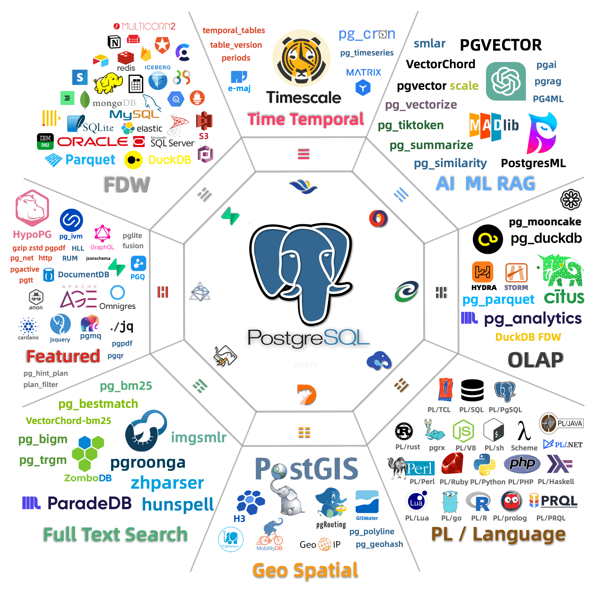

Harness the synergistic superpower of the PostgreSQL extensions ecosystem with three things:

- [**PIG CLI**](/pig/) : The PostgreSQL Extension Package Manager for Linux - `pig`
- [**Catalog**](/list) : Find the extension you need, with unparalleled 420+ extensions included
- [**Repository**](/repo) : Get pre-made RPM/DEB packages for 10 mainstream Linux OS


    
  
  


**Just use PostgreSQL for everything!** Also check our blog post: [***PostgreSQL is eating the Database World***](https://medium.com/@fengruohang/postgres-is-eating-the-database-world-157c204dcfc4)

## Catalog

       

       


  
  
  
  
  
  
  
  
  
  
  
  
  
  
  
  


        

     
      

--------

## Projects

Related projects on GitHub: [**github.com/pgsty**](https://github.com/pgsty)

| GitHub Repo                                                      | Description                                |
|------------------------------------------------------------------|--------------------------------------------|
| [github.com/pgsty/pigsty](https://github.com/pgsty/pigsty)       | PostgreSQL Database Distribution           |
| [github.com/pgsty/pig](https://github.com/pgsty/pig)             | PostgreSQL Package Manager                 |
| [github.com/pgsty/ext](https://github.com/pgsty/ext)             | This documentation site, Extension Catalog |
| [github.com/pgsty/rpm](https://github.com/pgsty/rpm)             | RPM Building Specs                         |
| [github.com/pgsty/deb](https://github.com/pgsty/deb)             | DEB Building Specs                         |
| [github.com/pgsty/infra-pkg](https://github.com/pgsty/infra-pkg) | Infra Package Building Specs               |

